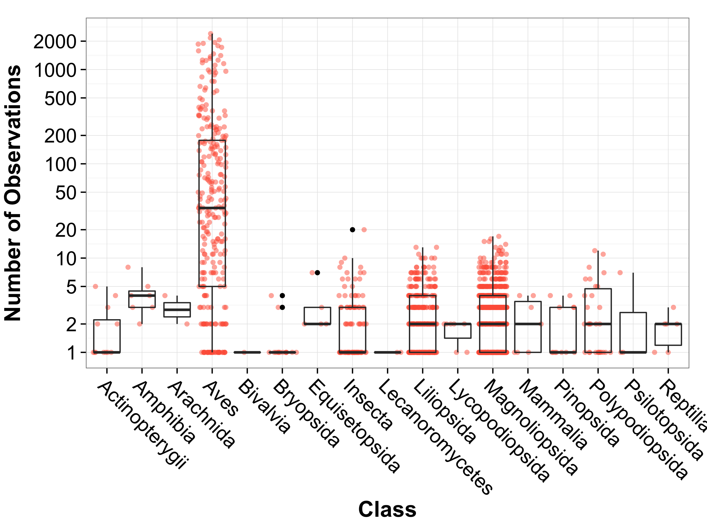
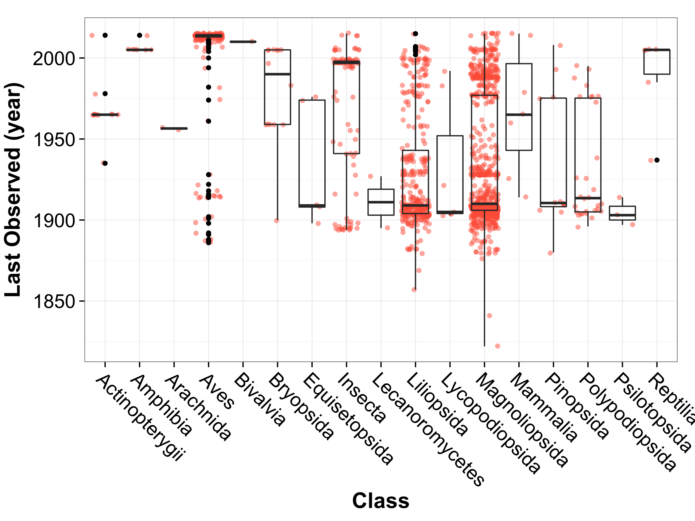

# GBIF Observations For CT Bioblitz 2016 
James Mickley  


## Historical Species Records in Hartford

I downloaded all of the observations on GBIF in the area of our bioblitz and took a quick look at the data last night.  This may give a starting point to look for rare species, species that haven't been seen in a while, and under-sampled groups.

The original dataset is is available from GBIF [here](http://doi.org/10.15468/dl.vptagl), but has been run through [OpenRefine](http://openrefine.org/) using [these steps](openrefine-data-cleaning-steps.json) to clean it up a bit. 

Then, the distance from Two Rivers Middle School was calculated using the [haversine formula](http://andrew.hedges.name/experiments/haversine/).  

The data includes some of Yale's collections, research-grade iNaturalist observations and some of UConn's collections.  A large portion of the observations are from eBird. 

I included all complete observations within a 5 mile radius, and then tallied up the number of observations for each species.  The entire dataset of all 63,000 observations is available [here](5-mile-radius-cleaned.csv.zip).

A more useful dataset is a list of species (1,575 total), with the number of observations summarized, and the location and coordinates of the most recent observation for that species.  That dataset is available [here](species-list.csv)

Finally, I [subset the list of species](no-obs-in-50yr.csv) to only include those that hadn't been recorded in the last 50 years in this area.  That still left 928 species.  


If you'd like to play with this yourself, feel free to download the data.  You can also download this folder and run the [R code](Historic Species.Rmd).


## Some Quick Graphs

This graph shows the number of observations for each species by taxonomic Class.  It looks like only plants and birds are fairly well-sampled, though this misses UConn's insect collection I think.  

 

And here's a distribution by class of the year where a species was last seen.  It looks like there are a lot of plant species in particular that have not been seen in a long time.  

 


### R Session Information (for posterity)


```
R version 3.2.2 (2015-08-14)
Platform: x86_64-apple-darwin13.4.0 (64-bit)
Running under: OS X 10.11.3 (El Capitan)

locale:
[1] en_US.UTF-8/en_US.UTF-8/en_US.UTF-8/C/en_US.UTF-8/en_US.UTF-8

attached base packages:
[1] stats     graphics  grDevices utils     datasets  methods   base     

other attached packages:
[1] dplyr_0.4.3   cowplot_0.5.0 ggplot2_1.0.1

loaded via a namespace (and not attached):
 [1] Rcpp_0.12.3       knitr_1.11        magrittr_1.5     
 [4] MASS_7.3-45       munsell_0.4.2     colorspace_1.2-6 
 [7] R6_2.1.1          stringr_1.0.0     plyr_1.8.3       
[10] tools_3.2.2       parallel_3.2.2    grid_3.2.2       
[13] gtable_0.1.2      DBI_0.3.1         htmltools_0.2.6  
[16] lazyeval_0.1.10   yaml_2.1.13       digest_0.6.9     
[19] assertthat_0.1    reshape2_1.4.1    formatR_1.2.1    
[22] codetools_0.2-14  evaluate_0.8      rmarkdown_0.8.1  
[25] labeling_0.3      stringi_1.0-1     scales_0.3.0.9000
[28] proto_0.3-10     
```
